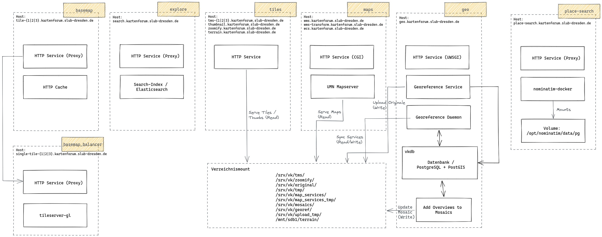

# Ansible-Scripts for the Virtual Map Forum 

This repository contains the configuration files and ansible scripts for deploying the different service of the Virtual Map Forum (VKF). The VKF is designed as a service-oriented architecture with different services and components. The following figure gives an overview about the architecture.

> :warning: The figure is currently missing the placename service as well as the TYPO3 setup with the web client. 

For each service component an [ansible scripts](https://www.ansible.com/)  is available, which describes the system setup.

## Service overview

### [service_basemap](./service_basemap/README.md) 

A tile server for delivering [OpenStreetMap](https://www.openstreetmap.org/) based map tiles. The service supports raster and vector tiles and is based on the [OpenMapTiles](https://openmaptiles.org/) ecosystem.

System requirements:
* Debian 11
* 140 GB SSD Storage
* 2 to 4 vCPU
* 2 to 4 GB RAM
* Public network or internal

Redundancy:
* 2 to 4 systems

Basically, the hardware requirements for delivering raster tiles are higher than for vector tiles, because in the case of raster tiles the server also handles the rendering of the tiles. More redundancy, CPU and RAM increase the performance.

### [service_basemap_balancer](./service_basemap_balancer/README.md) 

Distributes requests to the different basemap services according to a defined balancing algorithm. Uses a file cache for caching raster tiles. Should support multiple sub-domains so clients can request map tiles faster.

System requirements:
* Debian 11
* 40 GB Storage (Should scale with the cache size)
* 1 vCPU 
* 2 GB RAM
* Public network

### [service_explore](./service_explore/README.md) 

Contains the public metadata of the VKF and is used for map search. It is based on [Elasticsearch](https://www.elastic.co/de/elasticsearch/).

System requirements:
* Debian 11
* 10 GB Storage
* 2 vCPU
* 2 GB RAM
* Public network

### [service_tiles](./service_tiles/README.md) 

The service delivers tiles and images. It delivers static content, which is stored in the NFS mount. Uses multiple sub-domains to access the individual image and tile services.

System requirements:
* Debian 11
* 20 GB Storage
* 1 vCPU
* 2 GB RAM
* Public network

Mounts:
* NFS-Mount on _vkf-data_ (read-only)
 
### [service_maps](./service_maps/README.md) 

The service delivers maps via an UMN mapserver. It uses multiple sub-domains to access the individual map services.

System requirements:
* Debian 11
* 20 GB Storage
* 4 vCPU
* 8 GB RAM
* Public network

Mounts:
* NFS-Mount on _vkf-data_ (read-only)

### [service_explore](./service_place/README.md) 

Contains the geocoding service of the VKF. It is based on [mediagis/nominatim](https://hub.docker.com/r/mediagis/nominatim).

System requirements:
* Debian 11
* 740 GB GB Storage
* 2 vCPU
* 4 GB RAM
* Public network

### [service_geo](./service_geo/README.md) 

The service hosts the georeferencing service used by the web application and the daemon that synchronizes the search index entries and the maps and images services. 

System requirements:
* Debian 101
* 40 GB Storage
* 8 vCPU
* 16 GB RAM
* Private network

Mounts:
* NFS-Mount on _vkf-data_ (read and write)

### vkf-data (Verzeichnissystem)

The network file system, which contains all image and map data of the vkf.

System requirements:
* 3.5 TB Storage

## Ansible 

<table>
  <tbody>
    <tr>
      <th align="left">Placebook</th>
      <th align="center">Purpose</th>
      <th align="center">Requirements</th>
    </tr>
    <tr>
      <td align="left">core_setup/main.yml</td>
      <td align="left">Installs a base system with the user "vk2adm", blocks the "root" user for ssh and configures IP tables with open ports for SSH and HTTP/S</td>
      <td align="left">
        <ul>
            <li>Debian 11</li>
            <li>SSH-Login for User <code>root</code> via key file</li>
        </ul>
      </td>
    </tr>
    <tr>
        <td align="left">service_basemap/main.yml</td>
        <td align="left">Installs a standalone tile server with initial configuration and an Apache2 HTTP server as reverse proxy.</td>
        <td align="left">
            <ul>
                <li>Debian 11</li>
                <li>SSH-Login for User <code>vk2adm</code> via key file</li>
                <li>core_setup/main.yml was executed before</li>
            </ul>
        </td>    
    </tr>
    <tr>
        <td align="left">service_basemap_balancer/main.yml</td>
        <td align="left">Installs an software and apache based load balacner with caching capabilities for image serving.</td>
        <td align="left">
            <ul>
                <li>Debian 11</li>
                <li>SSH-Login for User <code>vk2adm</code> via key file</li>
                <li>core_setup/main.yml was executed before</li>
            </ul>
        </td>    
    </tr>    
    <tr>
        <td align="left">service_explore/main.yml</td>
        <td align="left">Installs a single node elasticsearch instance, with an Apache HTTP server as reverse proxy.</td>
        <td align="left">
            <ul>
                <li>Debian 11</li>
                <li>SSH-Login for User <code>vk2adm</code> via key file</li>
                <li>core_setup/main.yml was executed before</li>
            </ul>
        </td>    
    </tr>
    <tr>
        <td align="left">service_geo/main.yml</td>
        <td align="left">Installs the georeference service and daemon together with the database. The georeference service is proxied via an apache2 http reverse proxy.</td>
        <td align="left">
            <ul>
                <li>Debian 11</li>
                <li>SSH-Login for User <code>vk2adm</code> via key file</li>
                <li>core_setup/main.yml was executed before</li>
            </ul>
        </td>    
    </tr>    
    <tr>
        <td align="left">service_maps/main.yml</td>
        <td align="left">Installs an apache service for serving dynamic maps via mapserver.</td>
        <td align="left">
            <ul>
                <li>Debian 11</li>
                <li>SSH-Login for User <code>vk2adm</code> via key file</li>
                <li>core_setup/main.yml was executed before</li>
            </ul>
        </td>    
    </tr>   
    <tr>
        <td align="left">service_tiles/main.yml</td>
        <td align="left">Installs an apache service for serving files according to the tms and zoomify protocol as well as thumbnails.</td>
        <td align="left">
            <ul>
                <li>Debian 11</li>
                <li>SSH-Login for User <code>vk2adm</code> via key file</li>
                <li>core_setup/main.yml was executed before</li>
            </ul>
        </td>    
    </tr>   
  </tbody>
</table>
